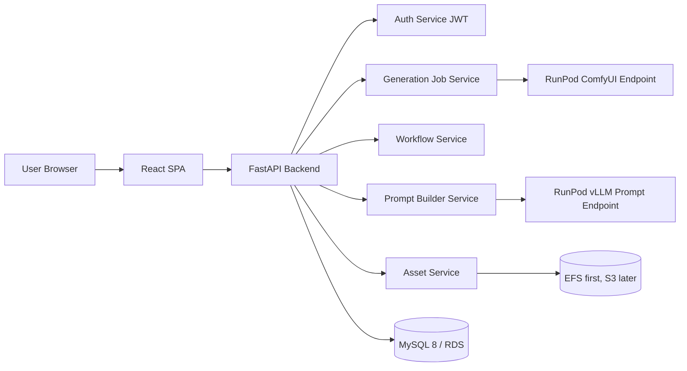
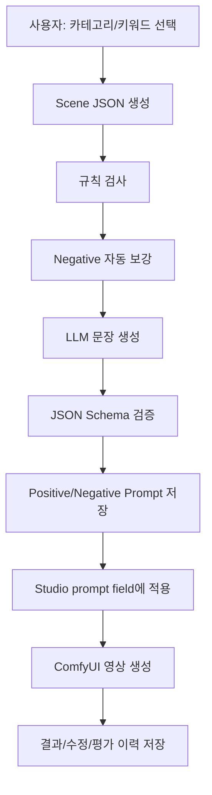

# DOBEDUB STUDIO 고도화 방안 설계

작성일: 2026-08-02  
대상: `comfyui-video-studio-app-v3`

## 1. 목적

현재 DOBEDUB STUDIO는 Python `http.server` 기반 단일 서버가 정적 UI, API, RunPod 연동, JSON 파일 저장을 모두 담당한다. 기능 검증과 빠른 운영에는 적합하지만, 사용자 증가, 작업 이력 검색, 워크플로우 버전 관리, 프롬프트 자산화, LLM 기반 프롬프트 생성 기능을 안정적으로 확장하기에는 한계가 있다.

고도화는 두 단계로 나눈다.

1. 프론트/백엔드 분리, FastAPI 백엔드, React 프론트, MySQL DB 도입
2. 프롬프트 카테고리/키워드 관리, 경량 LLM 기반 positive/negative 프롬프트 생성, 생성/수정/평가 이력 관리

## 1.1 2026-08-05 현재 적용 범위 요약

현재 v3는 로컬 실행 기준으로 다음 범위까지 적용되었다.

| 영역 | 적용 상태 |
|---|---|
| 실행 구조 | `server.py` monolith HTTP handler 제거, FastAPI 앱 실행 entrypoint로 축소 |
| Backend | FastAPI router/service/repository 구조로 auth, workflow, job, asset, history, config, metadata, prompt, manual, report API 이관 |
| Workflow | workflow parser, patch service, segment defaults loader, metadata loader, output service 분리 |
| RunPod | `/run`, `/status`, `/cancel`, `/health` 호출을 `runpod_client`로 분리. 실제 영상 생성 endpoint와 prompt LLM endpoint는 분리 설계 유지 |
| Storage | local/EFS compatible asset storage와 S3 adapter 초안 구현. 로컬 output은 `data/outputs` 저장 |
| Persistence | JSON adapter 유지 + DB adapter, Alembic, MySQL local migration, JSON-to-DB migration script 준비 |
| React | `/studio/app` React Studio shell, 작업 실행/취소/polling, history, status, manual, metadata modal 이관 및 `/studio/history`, `/studio/status`, `/studio/metadata`, `/studio/manual`, `/studio/admin` 라우트 전환 |
| Prompt Builder | 계층형 positive/negative catalog accordion, selected keywords, Scene Detail, Scene JSON build, mock prompt generation, 현재 segment 적용 구현 |
| Prompt Catalog Admin | fixed scope(Positive/Negative) 하위 category group, subcategory, keyword cascading CRUD UI/API 구현. Admin Console 내부 탭에서도 직접 관리 |
| Admin Console | 사용자 관리, Roles & Permissions, workflow 등록/활성화/비활성화, Prompt Catalog 관리 1차 구현. Metadata modal과 동일한 탭 스타일 적용 |
| Role/Permission Governance | `roles`, `permissions`, `role_permissions`, `user_permissions`, `ui_permission_resources` 기반 RBAC catalog 적용. 메뉴/액션/API는 effective permission 기준으로 guard |
| Auth/Session | DB 사용자 로그인 활성화. 서버 서명 JWT 기반 API 인증 1차 적용. 로그인 사용자의 이름을 우측 상단에 표시. 로그아웃/브라우저 종료 시 session storage 정리 |
| Prompt Catalog UX | scope는 편집 대상에서 제외. tree는 기본 접힘. 선택한 category/subcategory/keyword 레벨만 우측에 표시 |
| Keyword Form | 사용자 입력 필드 중심으로 정리. 기술 필드(code, canonical, risk, sort, categoryId)는 숨기고 내부 자동 처리 |
| Prompt Reuse/Review | `task_prompts` 기준 품질등급/코멘트/재사용 가능 여부 저장, 재사용 가능 프롬프트 검색/적용 1차 구현 |
| Workflow Admin Safety | workflow 등록 시 구조 validation, paramconfig 자동 생성, segment defaults 동기화, metadata rebuild, 기존 workflow/paramconfig 파일 백업 적용 |
| ECS Readiness | 운영 Docker entrypoint 분리, React production build stage, `.dockerignore`/`.gitignore` 운영 산출물 제외, ECS 환경변수/secret/migration 문서화, Docker image build 및 내부 파일 검증 완료 |
| 제외/보류 | `Load Past Prompts`, `Generate Report`는 UI에서 제거. TanStack Query는 현재 진행하지 않음. 관리자 workflow version table 기반 review/rollback, 실제 RunPod vLLM 품질 튜닝, ECR push/ECS service update는 사용자 승인 후 수행 |

현재 로컬 확인 URL은 `http://127.0.0.1:8790/studio/app`이다. ECS 운영 배포 전 로컬/컨테이너 preflight 검증은 통과했으며, 실제 ECR push와 ECS service update는 운영 배포 승인 후 수행한다.

## 2. 현재 구조 진단

현재 주요 구성은 다음과 같다.

| 영역 | 현재 상태 | 리팩터링 필요성 |
|---|---|---|
| 서버 | `server.py` 단일 파일, 약 2,300라인 | API, RunPod, 파일, 인증, 정적 서빙 책임 분리 필요 |
| 프론트 | `index.html`, `src/app.js`, `src/styles.css`, `frontend/` React SPA | 기존 vanilla UI와 React `/studio` 병렬 유지 중. 신규 기능은 React 중심으로 전환 |
| 저장소 | `data/*.json`, EFS 운영 | 검색/동시성/정합성/마이그레이션 한계 |
| 워크플로우 | `workflows/*.json`, `*.paramconfig.json`, `data/segment-defaults.json` | 버전 관리, 활성화/검증/롤백 관리 필요 |
| 작업 실행 | RunPod Serverless `/run`, `/status`, `/cancel`, `/health` | 서비스 계층으로 분리 필요 |
| 에셋 | 로컬/EFS 파일 + `assets.json` | DB 메타데이터 + 스토리지 분리 필요 |
| 인증 | 자체 입력값 중심 | 사용자 테이블, 비밀번호 해시, 권한 관리 필요 |

## 3. 목표 아키텍처



원칙은 다음과 같다.

- 프론트와 백엔드는 REST/JSON API로만 통신한다.
- 백엔드는 FastAPI로 전환하되, 기존 RunPod workflow patch 로직은 서비스 함수로 재사용한다.
- 작업 이력, 사용자, 워크플로우, 설정, 프롬프트, LLM 호출 이력은 MySQL에 저장한다.
- 업로드 이미지, 결과 MP4, 리포트 파일은 DB에 넣지 않고 스토리지에 저장한다.
- 운영 1차는 현재 ECS/EFS 흐름을 유지하고, 이후 S3로 전환한다.
- 워크플로우는 active version을 불변 참조한다. 과거 작업 재현성이 가장 중요하다.

## 4. Phase 1: 구조 분리 및 MySQL 전환

### 4.1 백엔드 구조

권장 디렉토리:

```text
backend/
  app/
    main.py
    core/
      config.py
      security.py
      database.py
    api/
      v1/
        auth.py
        workflows.py
        jobs.py
        assets.py
        history.py
        reports.py
        metadata.py
        prompts.py
        admin.py
    models/
    schemas/
    services/
      workflow_parser.py
      workflow_patcher.py
      runpod_client.py
      asset_storage.py
      job_service.py
      prompt_builder.py
      llm_client.py
    repositories/
    migrations/
```

핵심 서비스 분리는 다음 기준으로 한다.

| 서비스 | 책임 |
|---|---|
| `workflow_parser` | Export API JSON, paramconfig, segment defaults 파싱 |
| `workflow_patcher` | 사용자 입력값을 workflow graph에 반영 |
| `runpod_client` | `/run`, `/status`, `/cancel`, `/health` 호출 |
| `job_service` | 작업 생성, 상태 동기화, 완료/실패/취소 처리 |
| `asset_storage` | 업로드/다운로드/결과 파일 저장, presigned URL 전환 대비 |
| `prompt_builder` | 카테고리 선택값을 scene JSON으로 구조화 |
| `llm_client` | 프롬프트 생성 전용 LLM endpoint 호출 |

### 4.2 React 프론트 구조

권장 디렉토리:

```text
frontend/
  src/
    app/
      router.tsx
      providers.tsx
    pages/
      LoginPage.tsx
      StudioPage.tsx
      HistoryPage.tsx
      MetadataPage.tsx
      ManualPage.tsx
      AdminWorkflowsPage.tsx
      PromptBuilderPage.tsx
    components/
      studio/
      history/
      workflow/
      prompt/
      common/
    api/
      client.ts
      jobs.ts
      workflows.ts
      prompts.ts
    stores/
      authStore.ts
      studioStore.ts
    types/
```

초기 React 전환은 기존 UX와 회귀 범위를 줄이기 위해 `/studio` 내부 모달 구조를 유지한다. 페이지/라우트 분리는 관리자 기능과 정보 구조가 안정화된 뒤 선택적으로 진행한다.

| 현재 | 전환 |
|---|---|
| History/Saved Videos 모달 | React Studio 내 작업이력 모달 |
| Metadata 보기 모달 | React Studio 내 Metadata View 모달 |
| User Manual 모달 | React Studio 내 User Manual 모달 |
| 프롬프트 선택 모달 | Prompt 생성 결과 검토 후 유지/통합/제거 결정 |
| workflow list select | `/studio` 좌측 workflow panel 유지 |

상태 관리와 data fetching은 현재 `apiClient + useState/useEffect`를 유지한다. TanStack Query는 이번 단계에서 진행하지 않는다.

### 4.3 MySQL 핵심 스키마

Phase 1 최소 스키마는 다음 묶음으로 시작한다.

```text
users
workflows
workflow_versions
workflow_segment_defaults
workflow_param_bindings
workflow_param_binding_targets
assets
jobs
job_segments
job_input_images
job_output_assets
job_events
reports
```

설계 포인트:

- `jobs.workflow_version_id`는 작업 실행 당시 active version을 고정 참조한다.
- `jobs.patched_graph_json`은 실제 RunPod에 제출한 최종 graph snapshot을 저장한다.
- `job_segments.config_json`은 노출된 Wan config 값을 저장한다.
- `assets.storage_key`는 EFS path 또는 S3 object key를 저장한다.
- `workflow_versions.status`는 `draft -> validated -> active -> archived` 상태 모델로 관리한다.
- 신규 workflow upload 시 기존 active binding을 title/class_type 기반으로 자동 이관하고, 실패 항목은 `needs_review=1`로 관리자 검토 대상화한다.

### 4.4 API 설계

```text
POST   /api/v1/auth/login
POST   /api/v1/auth/refresh
POST   /api/v1/auth/logout

GET    /api/v1/workflows
GET    /api/v1/workflows/{workflow_id}
GET    /api/v1/workflows/{workflow_id}/schema
GET    /api/v1/workflows/{workflow_id}/segment-defaults

POST   /api/v1/assets
GET    /api/v1/assets/{asset_uid}

POST   /api/v1/jobs
GET    /api/v1/jobs/{job_uid}
POST   /api/v1/jobs/{job_uid}/cancel
GET    /api/v1/history
DELETE /api/v1/history/{job_uid}

POST   /api/v1/admin/workflows
POST   /api/v1/admin/workflows/{workflow_id}/versions
POST   /api/v1/admin/workflow-versions/{version_id}/validate
POST   /api/v1/admin/workflow-versions/{version_id}/activate
```

## 5. Phase 2: 프롬프트 카테고리/키워드 및 경량 LLM

### 5.1 권장 전체 흐름



LLM은 모든 판단을 맡기지 않는다. 앱이 먼저 구조화와 규칙 검사를 수행하고, LLM은 문장화와 중복 제거에 집중한다.

### 5.2 카테고리 모델

카테고리별 테이블을 각각 만드는 것보다 통합 테이블을 권장한다.

```text
prompt_scopes
prompt_category_groups
prompt_subcategories
prompt_subcategory_keywords
prompt_categories
prompt_category_terms
prompt_terms
prompt_term_relations
prompt_rules
prompt_templates
prompt_generation_requests
prompt_generation_outputs
prompt_feedback
model_profiles
prompt_term_renderings
```

현재 구현은 v0 최소형에서 v1 핵심 구조로 진입했다. Prompt Builder UI 기준 분류 체계는 다음 계층을 따른다.

```text
Positive Prompt / Negative Prompt: fixed scope, 편집 대상 아님
  └─ Category Group: 작품/스타일, 인물/대상, 카메라/구도 등
      └─ Sub Category: 장르, 콘텐츠 등급, 동작/움직임 등
          └─ Key Word: cinematic, documentary, soft smile 등 실제 선택값
```

첨부 제안 검토 결과, 운영형 Prompt Builder에서는 카테고리 체계를 세분화하고 선택 방식/적용 범위를 DB 속성으로 관리해야 한다. 기존 `prompt_categories`, `prompt_terms`, `prompt_category_terms`는 builder/rule 호환 레이어로 유지하고, 관리 UI는 `prompt_category_groups`, `prompt_subcategories`, `prompt_subcategory_keywords` 계층을 기준으로 동작한다.

| 그룹 | 코드 | 예 |
|---|---|---|
| 콘텐츠 | `GENRE` | cinematic, fantasy, documentary |
| 콘텐츠 | `CONTENT_RATING` | all ages, safe, brand-safe |
| 대상 | `SUBJECT_TYPE` | person, animal, product, object |
| 대상 | `CHARACTER_APPEARANCE` | outfit, hair, age range, expression |
| 동작 | `CHARACTER_ACTION` | walking, turning, dancing |
| 카메라 | `CAMERA_MOVEMENT` | dolly in, pan, tracking |
| 구도 | `CAMERA_FRAMING` | close-up, wide shot, eye-level |
| 환경 | `BACKGROUND`, `TIME_OF_DAY`, `WEATHER` | original background, day/night, rain |
| 조명 | `LIGHTING` | soft light, neon, backlight |
| 색감 | `COLOR_PALETTE` | warm, pastel, high contrast |
| 분위기 | `VIDEO_MOOD` | calm, dramatic, playful |
| 품질 | `QUALITY_TAG` | detailed, stable motion |
| 제한 | `NEGATIVE_ANATOMY`, `NEGATIVE_ARTIFACT`, `NEGATIVE_TEMPORAL` | blur, distortion, watermark |

운영형(v1) 보강 카테고리:

- 1차 반영: `GENRE`는 복합 장르를 허용하기 위해 `multi`로 변경했다.
- 1차 반영: `ACTION`의 핵심 동작은 `CHARACTER_ACTION`으로 이관했다.
- 1차 반영: 카메라는 `CAMERA_FRAMING`, `CAMERA_MOVEMENT`로 분리했다.
- 1차 반영: 공간/시간은 `BACKGROUND`, `TIME_OF_DAY`, `WEATHER`를 추가했다.
- 1차 반영: 색감/분위기는 `COLOR_PALETTE`, `VIDEO_MOOD`로 분리했다.
- 1차 반영: 네거티브는 `NEGATIVE_ANATOMY`, `NEGATIVE_ARTIFACT`, `NEGATIVE_TEMPORAL`로 분리했다.
- 추가 반영: `OBJECT_ACTION`, `MOTION_SPEED`, `MOTION_INTENSITY`, `CAMERA_ANGLE`, `LENS_TYPE`, `FOCUS_STYLE`, `CLOTHING`, `POSE`, `GAZE_DIRECTION`, `FACIAL_EXPRESSION`, `EMOTION`, `ANIMATION_STYLE`, `RENDERING_STYLE`, `SCENE_TRANSITION`, `SHOT_DURATION`, `NEGATIVE_QUALITY`, `NEGATIVE_CAMERA`, `NEGATIVE_TEXT` 예시 catalog 데이터를 추가했다.

DB 속성 보강:

- `prompt_categories`: `parent_category_id`, `scope_type`, `selection_type`, `required_yn`, `max_select_count`를 추가한다.
- `prompt_terms`: `canonical_key`, `description`, `risk_level`을 추가한다.
- `prompt_category_terms` 중간 테이블을 추가해 term 재사용을 허용한다.
- `prompt_scopes`, `prompt_category_groups`, `prompt_subcategories`, `prompt_subcategory_keywords`를 추가해 관리 UI의 scope/category/subcategory/keyword 계층을 별도로 표현한다.
- 모델별 표현은 `model_profiles`, `prompt_term_renderings`로 분리한다.

### 5.3 Prompt Builder 입력/출력

입력은 사용자가 고른 단어 그대로 LLM에 던지지 않고 scene JSON으로 정규화한다.

```json
{
  "workflow_key": "1-images.json",
  "language": "ko",
  "scene": {
    "genre": ["cinematic"],
    "subject": {
      "type": "person",
      "appearance": ["same identity as input image"]
    },
    "action": ["gentle walking motion"],
    "camera": ["slow tracking shot"],
    "lighting": ["soft natural light"],
    "mood": ["calm"]
  },
  "constraints": {
    "preserve_identity": true,
    "avoid_new_objects": true,
    "i2v_mode": true
  }
}
```

위 구조는 v0 구조다. 객체가 둘 이상일 때 “누가 무엇을 하는지”가 모호해지는 문제가 있으므로 v1에서는 scene/entity/relation 구조로 확장한다.

Scene JSON v1 1차 구현 기준:

```json
{
  "workflowId": "1-images.json",
  "language": "ko",
  "scenes": [
    {
      "sequenceNo": 1,
      "summary": "",
      "entities": [
        {
          "id": "entity_1",
          "type": "PERSON",
          "name": "person",
          "importance": "PRIMARY",
          "referenceAssetId": null,
          "attributes": [],
          "actions": []
        }
      ],
      "relations": [],
      "camera": {
        "framing": [],
        "angle": [],
        "movement": [],
        "lens": [],
        "focus": []
      },
      "environment": {
        "background": [],
        "location": [],
        "timeOfDay": [],
        "weather": []
      },
      "style": {
        "lighting": [],
        "colorPalette": [],
        "mood": [],
        "animationStyle": [],
        "renderingStyle": []
      },
      "motion": {
        "speed": [],
        "intensity": []
      },
      "quality": [],
      "negativeTerms": []
    }
  ],
  "constraints": {
    "preserve_identity": true,
    "avoid_new_objects": true,
    "i2v_mode": true
  }
}
```

현재 React Prompt Builder UX 기준:

- 사용자는 Positive/Negative fixed scope 하위 category group/subcategory accordion에서 key word를 선택한다.
- 선택된 key word는 positive/negative 박스에 comma-separated text로 표시된다.
- 복수 entity/relation 직접 편집 UI는 현재 노출하지 않는다.
- 부족한 장면 설명은 `Scene Detail` 자유 입력 필드로 보완한다.
- `Build Scene JSON` 실행 시 선택 key word와 `Scene Detail`이 Scene JSON에 반영된다.
- `Generate Prompt` 실행 시 mock provider가 positive/negative prompt를 생성하고 현재 선택 subgraph prompt field에 적용할 수 있다.

LLM 출력은 반드시 JSON Schema로 제한한다.

```json
{
  "positive_prompt": "A concise English paragraph...",
  "negative_prompt": "blur, distortion, extra limbs...",
  "used_term_ids": [101, 203],
  "added_term_ids": [901],
  "warnings": []
}
```

### 5.4 LLM 구성

프롬프트 생성 전용 LLM은 ComfyUI RunPod endpoint와 분리한다.

| 항목 | 권장 |
|---|---|
| 배포 | RunPod Serverless 별도 endpoint |
| 추론 서버 | vLLM |
| 모델 | `Qwen/Qwen3-4B-Instruct-2507` 우선 검토 |
| GPU | 16GB급 A4000/A4500/RTX 4000 계열부터 검증 |
| API | OpenAI-compatible `/v1/chat/completions` 또는 내부 `/generate-prompt` |
| 출력 | JSON only |

분리 이유:

- ComfyUI 영상 생성과 LLM이 같은 GPU VRAM을 경쟁하지 않는다.
- ComfyUI 재시작/워크플로우 오류가 프롬프트 생성 기능까지 중단시키지 않는다.
- LLM endpoint는 짧은 요청 중심이라 별도 autoscale이 쉽다.
- 향후 VL 모델 도입 시 독립 확장 가능하다.

### 5.5 초기에는 파인튜닝하지 않는다

초기 품질은 다음 순서로 확보한다.

1. 카테고리/키워드 사전
2. 조합 규칙
3. 시스템 프롬프트
4. JSON Schema
5. 장르별 few-shot 예제
6. 사용자 수정 이력
7. 결과 평가

운영 데이터가 쌓인 뒤 다음 데이터를 학습셋 후보로 삼는다.

```text
scene_json
initial_llm_prompt
user_edited_prompt
final_generation_result
user_rating
```

## 6. 단계별 실행 계획

### Step 0. 동결 및 회귀 기준 수립

- 현재 v2를 `legacy-monolith` 기준으로 고정한다.
- 주요 동작을 smoke test로 문서화한다.
- RunPod 실제 실행, cancel, history view, rework, asset download, segment defaults, metadata view를 회귀 기준으로 둔다.

### Step 1. FastAPI 백엔드 skeleton

- 기존 `server.py` 라우트를 FastAPI endpoint로 1:1 이전한다.
- 저장소는 아직 JSON/EFS adapter를 유지한다.
- 프론트는 기존 vanilla JS가 새 FastAPI API를 호출하도록 임시 연결 가능하게 한다.

완료 기준:

- 기존 UI에서 모든 API 동작이 동일하다.
- `server.py` 핵심 로직이 `services/`로 분리된다.

### Step 2. MySQL 도입

- SQLAlchemy/Alembic 설정
- JSON 파일 마이그레이션 스크립트 작성
- repository layer를 JSON adapter에서 MySQL adapter로 교체
- EFS 파일은 유지하고 DB에는 asset metadata만 저장

완료 기준:

- 로컬에서 기존 history/assets/configs를 MySQL로 이관할 수 있다.
- JSON adapter와 DB adapter가 같은 API response shape를 유지한다.
- 재작업과 결과 preview에 필요한 DB adapter smoke test가 통과한다.
- ECS/RDS 전환은 운영 배포 단계의 별도 완료 기준으로 둔다.

### Step 3. React 전환

- Vite + React + TypeScript scaffold
- `/studio` 중심 shell 구성
- History, Status, Manual, Metadata, Admin은 Studio 내 모달로 이관하되 `/studio/history`, `/studio/status`, `/studio/metadata`, `/studio/manual`, `/studio/admin` 경로로 직접 진입할 수 있게 한다.
- job polling, history pagination, workflow schema cache는 우선 `apiClient + useState/useEffect`로 구현
- TanStack Query는 현재 진행하지 않고 `apiClient + useState/useEffect`를 유지한다.
- 기존 CSS 토큰/시각 스타일을 단계적으로 이식

완료 기준:

- 기존 기능 parity 달성
- 주요 작업 실행/이력/상태/매뉴얼/메타데이터 기능이 React Studio에서 동작한다.
- 모바일/데스크톱 주요 화면 깨짐 없음
- `Load Past Prompts`와 `Generate Report`는 UI에서 제거한다.
- 별도 페이지 라우팅은 `/studio/*` 하위 경로 기준으로 반영한다.
- TanStack Query는 현재 단계에서 도입하지 않는다.

### Step 4. 관리자 워크플로우/메타데이터 관리

관리자 기능은 1차로 사용자 관리, workflow JSON 등록, active/inactive 전환, Prompt Catalog 관리까지 구현한다. 운영 리스크가 큰 version 검증, metadata snapshot, binding 자동 이관, rollback은 Prompt Builder와 작업 실행 흐름이 안정화된 뒤 후순위 backlog로 진행한다.

1차 완료 범위:

- 사용자 조회, 추가, 수정, 비활성화, 비밀번호 저장/재설정 API
- 사용자 관리 UI는 좌측 목록 선택, 우측 상세/편집 구조로 제공
- workflow 조회, JSON 파일 불러오기 후 등록, active/inactive 전환 API
- workflow 관리 UI는 좌측 workflow 선택, 우측 상세/등록 구조로 제공
- inactive workflow의 Studio workflow list 제외
- Prompt Catalog Admin을 별도 모달 호출 없이 Admin 내부 탭 콘텐츠로 제공
- selected 상태와 active 상태를 별도 하이라이트/배지로 구분

후순위 고도화 범위:

- workflow upload
- workflow version parsing
- node/widget tree view
- param binding target 검토
- metadata snapshot upload
- active version 승격

완료 기준:

- 새 workflow JSON 업로드 후 draft version 생성
- 기존 binding 자동 이관
- 관리자 검토 후 active 전환
- 기존 작업은 과거 workflow version으로 재현 가능

### Step 5. 프롬프트 DB

Step 5는 두 단계로 분리한다.

Step 5A, 현재 완료된 v0:

- prompt category/term/rule/template 기본 schema
- Studio 화면에서 카테고리 기반 prompt builder 추가
- 기존 직접 입력 방식 유지

Step 5B, 다음 보완 단계:

- 첨부 제안 기준 catalog v1 schema 보강 완료
- Scene JSON v1 구조 확정 및 schema artifact 분리 완료
- selection/required/max count/rule validation backend 검증 완료
- 모델별 term rendering과 model profile 기반 prompt 표현 분리 완료
- 계층형 Prompt Catalog Admin CRUD 1차 구현 완료
- Prompt Builder UX는 key word 선택 + Scene Detail 중심으로 단순화 완료

완료 기준:

- 사용자가 category/term 선택으로 scene JSON을 만들 수 있다.
- positive/negative를 자동 생성 전 단계까지 구성할 수 있다.
- backend scene schema는 scene/entity/relation 구조를 지원한다.
- frontend는 현재 entity/relation 직접 편집 대신 Scene Detail 입력으로 장면 보완 정보를 받는다.
- single/multi/required/max count 규칙이 DB 속성과 backend validation으로 보장된다.

현재 구현 기준:

- `prompt_categories`, `prompt_terms`, `prompt_term_relations`, `prompt_rules`, `prompt_templates`, `prompt_generation_requests`, `prompt_generation_outputs`, `prompt_feedback` schema를 추가한다.
- `prompt_scopes`, `prompt_category_groups`, `prompt_subcategories`, `prompt_subcategory_keywords`, `model_profiles`, `prompt_term_renderings` schema를 추가한다.
- 기본 category/term/rule/template 예시 catalog 데이터를 테스트/초기 검증용으로 제공한다. 운영 UI/API에서는 예시 데이터 적용 액션을 노출하지 않는다.
- `/api/prompts/catalog`로 카테고리/키워드/룰/템플릿을 조회한다.
- `/api/prompts/scene`으로 선택 term 기반 scene JSON과 deterministic prompt draft를 생성한다.
- 기존 Studio의 positive/negative 직접 입력 방식은 유지한다.
- React Prompt Builder UI와 segment prompt field 적용 흐름을 구현했다.
- Prompt Catalog Admin은 fixed scope, category group, subcategory, key word 계층을 관리한다.
- key word 관리 화면은 사용자 입력 필드와 생성 prompt text 필드만 노출하고, code/canonical/categoryId/risk/sort 같은 기술 필드는 내부 처리한다.
- 현재 구현은 local mock prompt generation과 실제 RunPod vLLM 호출 경로까지 포함한다. 실제 LLM 품질 검증과 운영 카탈로그 데이터 정비가 다음 보완 대상이다.

### Step 6. LLM 프롬프트 생성

- RunPod vLLM endpoint 구성
- `/api/v1/prompts/generate` API 추가
- JSON Schema validation
- 생성 이력/사용자 수정 이력 저장
- prompt 적용 버튼으로 Studio prompt field에 주입

완료 기준:

- LLM이 positive/negative JSON을 반환한다.
- 실패/검증 오류 시 fallback 메시지와 재시도 가능
- 생성된 prompt, 수정 prompt, 사용된 term, warnings가 DB에 저장된다.

현재 구현 기준:

- `PROMPT_LLM_PROVIDER`, `PROMPT_LLM_API_KEY`, `PROMPT_LLM_ENDPOINT_ID`, `PROMPT_LLM_ENDPOINT_URL`, `PROMPT_LLM_MODEL`, `PROMPT_LLM_TEMPERATURE`, `PROMPT_LLM_MAX_TOKENS`, `PROMPT_LLM_TIMEOUT` 환경변수로 LLM 설정을 분리한다.
- 기본 provider는 `mock`으로 두어 로컬에서 deterministic prompt generation을 검증한다.
- `PROMPT_LLM_PROVIDER=runpod_vllm`이면 RunPod Serverless native `/runsync` 방식으로 prompt endpoint를 호출한다.
- `PROMPT_LLM_PROVIDER=openai_compatible`이면 vLLM OpenAI-compatible `/chat/completions` 방식으로 prompt endpoint를 호출한다.
- `/api/prompts/generate`는 scene JSON을 받아 positive/negative prompt를 생성하고 DB에 저장한다.
- `/api/prompts/feedback`은 생성 결과에 대한 rating, 수정 prompt, notes를 저장한다.
- Scene JSON v1 표준 JSON Schema artifact와 runtime validation은 적용했다.
- 실제 RunPod vLLM 호출 경로는 mock network response로 smoke 검증했다. 운영 endpoint 품질/응답 형식은 실제 endpoint 설정 후 수동 확인한다.

### Step 7. Job/Task 중심 작업관리

작업관리는 workflow 파일 자체가 아니라 사용자의 생성 실행 단위인 job/task를 기준으로 관리한다. `workflow_tasks`는 job 목록의 부모 테이블이며, 생성 버튼 이벤트가 발생하는 즉시 record가 생성되어야 한다.

현재 구현 기준:

- `workflow_tasks`를 job 원장 테이블로 사용한다.
- `task_input_assets`는 job 생성에 사용한 입력 이미지 asset을 `task_id` 기준으로 연결한다.
- `task_output_assets`는 job 완료 후 생성된 final/segment output asset을 `task_id` 기준으로 연결한다.
- `task_prompts`를 추가하여 실제 ComfyUI/WAN workflow에 전달된 segment별 최종 prompt를 저장한다.
- `task_prompts`는 `task_id`, `workflow_id`, `segment_index`, `model_name`, `prompt_generation_output_id`, positive/negative prompt, input/output asset id, 품질등급, 코멘트를 가진다.
- 작업 완료 후 output asset id를 `task_prompts.output_asset_ids`에도 반영해 prompt 재활용/품질평가/결과 추적이 가능하도록 한다.
- `/api/jobs/{task_id}/prompts`로 job 하위 prompt를 조회할 수 있다.
- `/api/jobs/{task_id}/prompts/{segment_index}/quality`로 품질등급과 코멘트를 수정할 수 있다.
- history 조회는 DB `workflow_tasks` 원장 이력을 우선 사용하고, 과거 JSON history는 `taskId` 기준으로 병합한다.
- 서버 재시작 등으로 메모리 `JOBS`가 비어도 `/api/jobs/{task_id}` 호출 시 DB `workflow_tasks`에서 job 상태를 복구한다.

아직 남은 전환:

- prompt 재활용 UI에서 `task_prompts`의 품질등급/코멘트/재사용 사유를 검색, 필터, 재사용 기준으로 활용하는 1차 구현은 완료했다.
- history 삭제는 현재 JSON 호환 삭제와 DB task 삭제를 병행한다. 최종 DB 전환 단계에서 asset 참조/삭제 정책을 DB adapter 기준으로 단일화한다.

### Step 8. ECS 운영 배포 준비

운영 배포 전 로컬 테스트 데이터, 하드코딩 경로, 컨테이너 포함 파일을 점검한다.

현재 구현 기준:

- Docker image는 `frontend/` production build를 별도 Node stage에서 생성하고 최종 Python image에 `/app/frontend/dist`로 포함한다.
- 운영 container entrypoint는 `scripts/run_server.py`이며, serving만 담당한다. DB migration은 `scripts/upgrade_database.py`를 one-off/CI task로 실행한다. ECS에서는 `RUN_SERVER_AUTO_MIGRATE=0`을 유지하고 startup migration과 app serving을 분리한다.
- Docker 기본 `PORT`와 `EXPOSE`는 기존 ECS service target 기준인 `7860`으로 맞춘다.
- `.dockerignore`는 `.env`, 로컬 SQLite DB, 업로드 이미지, 생성 영상, 리포트, build cache, 구버전 `src/`, workflow backup을 제외한다.
- 운영 image의 `/app/data`에는 bundled 기본값인 `data/segment-defaults.json`만 포함한다.
- 운영 환경변수와 secret 기준은 `docs/aws-ecs-deployment.md`에서 관리한다.

완료 검증:

- `npm run build` 통과
- `python3 scripts/frontend_smoke_check.py` 통과
- `python3 scripts/rbac_permission_smoke_check.py` 통과
- `python3 scripts/admin_smoke_check.py` 통과
- `python3 scripts/fastapi_smoke_check.py` 통과
- `python3 scripts/db_migration_smoke_check.py` 통과
- `python3 scripts/storage_backend_smoke_check.py` 통과
- `docker build -t dobedub-studio:ecs-check .` 통과
- Docker image 내부에 `.env`, `data/dobedub-studio.db`, `data/uploads`, `data/outputs`, 구버전 `src/`가 없고 `data/segment-defaults.json`만 포함됨을 확인

남은 운영 배포 작업:

- ECS/RDS 대상 Alembic migration은 one-off task 또는 CI/CD 단계에서 먼저 실행한 뒤 web task를 배포한다. `RUN_SERVER_AUTO_MIGRATE=0`을 유지해 startup crash 위험을 줄인다.
- ECR push
- ECS task definition revision 등록
- ECS service update
- ALB/서비스 URL에서 로그인, 권한, workflow 목록, prompt builder, task 생성, history, metadata, manual, RunPod/Qwen status 후속 점검

## 7. 주요 리스크와 대응

| 리스크 | 대응 |
|---|---|
| 한 번에 React/FastAPI/MySQL을 모두 바꾸면 회귀 범위가 큼 | JSON adapter 유지 상태로 FastAPI 먼저 이식 |
| workflow version/binding이 틀리면 RunPod 실행 실패 | draft/validated/active 상태 모델과 관리자 검토 |
| DB 이관 후 기존 이력 preview/download 깨짐 | asset storage key와 기존 EFS path 매핑 검증 |
| 작업 실행 중 서버 재시작 시 메모리 job 상태 유실 | `workflow_tasks`에 생성 즉시 기록하고 status 조회 시 DB task에서 in-memory job을 복구 |
| prompt 재활용 시 어떤 결과와 연결된 prompt인지 불명확 | `task_prompts`에 segment/model/input/output/quality 정보를 함께 저장 |
| LLM이 입력에 없는 요소를 생성 | scene JSON, rule check, system prompt, JSON Schema, warnings |
| ComfyUI와 LLM GPU 경쟁 | 별도 RunPod endpoint |
| prompt quality가 불안정 | 초기에는 파인튜닝 금지, 규칙/템플릿/few-shot/이력 기반 개선 |
| 기능 목록 변경 시 권한/메뉴/API 매핑 누락 | `roles`, `permissions`, `role_permissions`, `user_permissions`, `ui_permission_resources`를 도입하고 기능 resource catalog 기준으로 frontend/backend guard를 함께 관리 |
| 로컬 DB/업로드/출력물이 운영 image에 포함 | `.dockerignore`로 local artifact를 차단하고 Docker image 내부 파일 검증을 배포 전 수행 |
| web task 시작 시 migration 자동 실행 | 운영 runner는 serving 전용으로 두고, migration은 `scripts/upgrade_database.py` one-off task로 분리 |
| ECS 환경변수 누락 시 local fallback으로 실행 | `docs/aws-ecs-deployment.md`의 필수 env/secret checklist를 task definition에 반영하고 배포 후 `/api/health`, Check Status로 확인 |
| S3 전환 시 URL/권한 문제 | storage adapter 인터페이스를 먼저 만들고 EFS/S3 구현 분리 |
| 브라우저 종료 시 진행 중 Task가 멈춰 보임 | `workflow_tasks` 활성 행을 서버 lifecycle monitor가 주기적으로 폴링하고, Task History가 활성 상태를 포함해 조회 |
| 여러 사용자가 동시에 제출해 RunPod 큐/비용이 급증 | DB singleton 정책으로 사용자별/전체 활성 Task 한도를 검사하고 관리자 권한으로 조정 |

## 8. 권장 우선순위

가장 안전한 순서는 다음이다.

1. `server.py` 서비스 분리
2. FastAPI skeleton + 기존 JSON adapter
3. MySQL schema/Alembic + migration
4. React shell + 기능 parity
5. Prompt category DB와 catalog/scene API
6. Prompt Builder UI와 현재 segment 적용
7. 기존 `Load Past Prompts`/`Generate Report` UI 제거 및 `/studio/*` 페이지 라우트 전환
8. Prompt catalog v1 schema 및 Scene JSON v1 validation
9. LLM prompt endpoint
10. prompt feedback/analytics
11. Role/Permission/Feature Governance DB 및 Admin 관리 UI
12. 관리자 workflow version/metadata validation/review/rollback 고도화
13. ECS 운영 배포 preflight
14. ECR push 및 ECS service update
15. S3 storage 운영 전환 고도화
16. 다중 ECS replica 전환 전 제출 한도의 DB 원자성/분산 잠금 검토

후순위로 이동하거나 제외한 항목의 이유:

- 페이지 라우트 전환: `/studio/history`, `/studio/status`, `/studio/metadata`, `/studio/manual`, `/studio/admin` 경로 전환을 반영했다. 화면 구성은 기존 Studio shell 위에 모달을 여는 방식으로 유지한다.
- TanStack Query: API response shape와 polling 정책이 아직 정리 중이므로, 이번 단계에서는 도입하지 않고 `apiClient + useState/useEffect`를 유지한다.
- 관리자 workflow 고도화: 1차 active/inactive 전환은 구현했다. 다만 version validation, binding 이관, rollback은 RunPod 실행 성공률에 직접 영향을 주므로 Prompt Builder와 작업 화면이 안정화된 뒤 별도 단계로 착수한다.
- Role/Permission Governance: `roles`, `permissions`, `role_permissions`, `user_permissions`, `ui_permission_resources` 기반 1차 전환은 완료했다. 기능 목록이 바뀔 때 catalog seed, 메뉴 노출, 버튼 활성화, API guard가 함께 갱신되는지 smoke test와 Admin 화면에서 계속 검증한다.

프롬프트 LLM 기능은 React/MySQL 전환 후 붙이는 것이 좋다. 생성 프롬프트와 사용자 수정 이력을 구조적으로 저장해야 나중에 품질 개선과 파인튜닝 판단이 가능하기 때문이다. `Load Past Prompts`와 `Generate Report`는 현재 UI 범위에서 제거하고, 필요 시 별도 신규 요구사항으로 재설계한다.

## 9. 1차 구현 산출물

다음 작업부터 착수한다.

- `backend/` FastAPI 프로젝트 scaffold
- `frontend/` React/Vite scaffold
- `docker-compose.dev.yml`에 backend, frontend, mysql 추가
- Alembic initial migration
- 기존 `data/*.json` → MySQL migration script
- 기존 `server.py`에서 RunPod/workflow/asset 로직 추출
- `/api/v1/health`, `/api/v1/workflows`, `/api/v1/jobs`부터 이전

이 단계에서는 UI 디자인 변경보다 기능 parity와 데이터 정합성을 우선한다.
